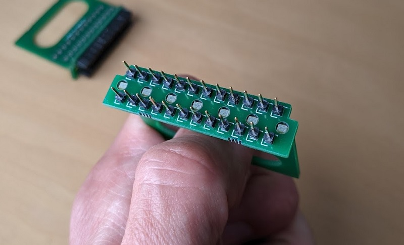
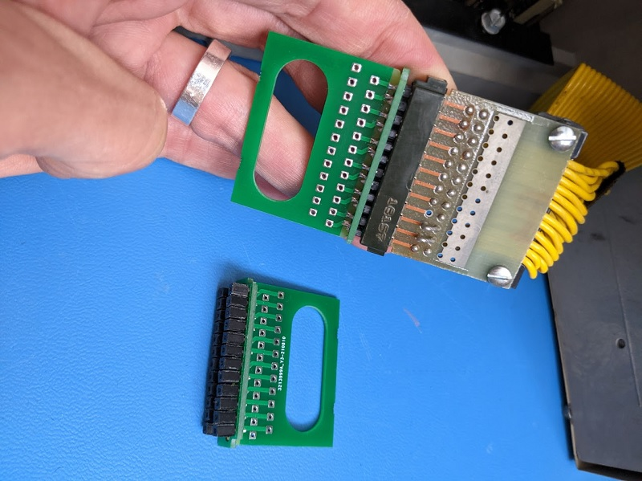
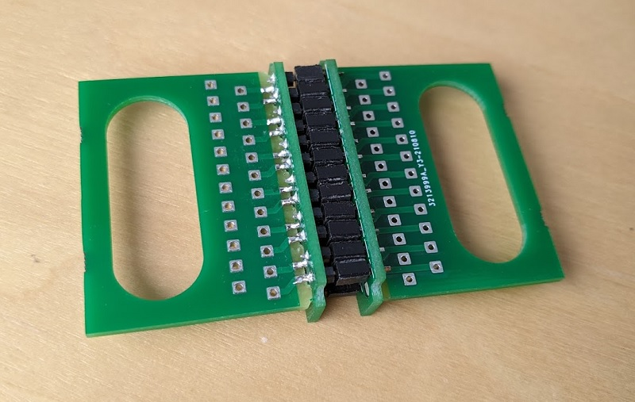

# SLT card system wire-to-board interconnect

This project aims to construct a modern replacement for the wire-to-board
connectors that IBM used inside some products incorporating their proprietary
Solid Logic Technology (SLT) and Monolithic System Technology (MST) circuit
design systems. The design has features like wide circuit board traces intended
to make it suitable for use as a power connector, but there's no reason it
couldn't be used for logic interconnect as well.

## Fair warning

This hardware design and all other materials distributed alongside it are made
available for free with NO WARRANTY OF ANY KIND. Any system that interfaces
with hardware built from this design could suffer malfunction, data loss,
physical damage, or other harms. Some of these effects could be permanent
and/or unrepairable. If you're not prepared to risk these consequences, don't
use these resources.

## Background and motivation

Most people familiar with SLT and MST will think of the square aluminium
housings for hybrid circuits and ICs (respectively) that appeared on IBM
components from the 1960s through the 1990s. As it happens, SLT and MST
specifications also described ways of building circuit boards and connecting
them together. SLT and MST-based components saw widespread use in IBM products,
from typewriters to large mainframe computers.

SLT and MST's most common methods of interconnect were based on 24-pin
header-style connectors. "Plugs" (my terminology) were simply made from two
rows of twelve individual metal pins embedded in a circuit board; these were
usually found on boards meant to connect other boards together, like
backplanes. "Sockets" that mated with these plugs were formed from metal
spring contacts lined up on the edges of circuit boards and surrounded by a
plastic shroud; these were usually found on modular cards that held electronic
components (ICs, resistors, etc.). They could also appear on wire-to-board
connectors, where multiple wires or a flat ribbon cable would be soldered
directly to a small circuit board with an integrated socket connector on one
edge.

[This blog post](http://techandtrouble.blogspot.com/2014/04/happy-50th-system360-pt5-anatomy-of-slt.html)
presents a good illustrated overview of SLT and MST cards and their connectors.
As it notes, the unusual arrangement of 1/8-inch (3.175mm) spacing between pins
on the same row, plus the 1/4-inch (6.35mm) spacing between rows, is
incompatible with common header connectors manufactured today.

Lacking off-the-shelf options for SLT and MST interconnect, we can arrange
modern components in a way that is compatible with the IBM designs.

## Gallery and notes

_Figure 1._ Our wire-to-board adaptor is economically constructed from two
small circuit boards joined together perpendicularly, and from single-pin
header pins and sockets arranged according to the 1/8-inch (3.175mm) and
1/4-inch (6.35mm) spacing requirements.

_Figure 2._ The two circuit boards are "glued" together by solder joints that
also connect the connector header pins and sockets to the plated through-holes
where wires will terminate. Threading the wires through an oval-shaped hole on
the vertical circuit board can help them stay tidy and may offer some amount of
strain relief. The mechanical strength of the solder-bonded joint between the
circuit boards is considerable, and most applications are unlikely to require
additional reinforcement there.

_Figure 3._ The nonstandard pin spacing makes it a bit tricky to ensure a tidy
alignment of the constituent pins and sockets, especially if these parts are
made by trimming breakaway or cuttable strips and therefore vary in size.
Perfection may be impossible, but persistence can give you a functional
arrangement that orients square pins and square sockets to align roughly with
the board itself. Note that like the plastic shroud on the original IBM socket
connector, the connector's horizontal circuit board is also polarised by square
notches in two of its corners.

_Figure 4._ The plug adaptor can mate with an original IBM SLT/MST socket, like
the one on this wire-to-board power connector from an IBM 5100 portable
computer. It's not clear that this arrangement would be reliable without an
additional means of securing the connectors together: by wiggling both of them
around the connection as if it were a hinge, they can come apart fairly easily.

_Figure 5._ Naturally, the plug and socket adaptors can connect to each other,
but the same caveat about security applies.

_Figure 6._ When made with low-profile pin sockets, the socket adaptor can fit
into the same places where real IBM wire-to-board socket adaptors go. Like the
IBM original, our adaptor is liable to come loose of the plug unless it is
restrained somehow. For this, the IBM 5100 makes use of a metal bracket coated
in a non-conductive black enamel finish.

_Figure 7._ Unfortunately, there is a problem. A restraining device like this
metal bracket may impinge on the exposed solder joints that attach the
individual header pin sockets to the horizontal circuit board. If the device is
conductive or if it has a non-conductive coating that can wear away, these pins
may be shorted.  The designs of modern pin header sockets and of the original
IBM plug connector make it unlikely that a different circuit board design can
avoid this issue.

_Figure 8._ This close-up of the IBM 5100's bracket suggests that its enamel
coating is already wearing away. The best option for avoiding shorts in
situations like these may be to add additional layers of insulation between the
adaptor and the restraint. One specific option in this setting could be to
apply a durable lacquer or varnish to the solder joints, and then to supplement
the bracket's enamel coating with a folded strip of polyimide ("Kapton") tape.

## Parts

Our adaptors require shorter "low profile" components in order to fit in the
same places where the original IBM plugs and sockets were designed to go.

For socket adaptors, the header pin sockets should extend no further than 5.2mm
from the horizontal circuit board. So far, the components used have been
[Samtec CES-101-01-S-S](https://www.samtec.com/products/ces-101-01-s-s)
single-pin sockets, though socket adaptors made with these may be more liable
to "back out" from original IBM plugs than the IBM sockets were. Note that
using even shorter pin-header sockets than these might cause the adaptor to
rest too low in the plug for the original restraint to keep it in place.

For plug adaptors, the header pins should probably not have a mating contact
length that extends beyond 5mm. So far, the components used have been
single-pin 3M 951101-8622-AR pins (no convenient link).

## Assembly

The design files in this repository describe a single "combined" circuit board
with two detachable pieces. The image above shows both sides of this combined
board. Its lower detachable portion forms the "horizontal" circuit board while
the upper portion forms the "vertical" circuit board.

Both sides of the vertical circuit board are functionally identical. The
horizontal circuit board is different: it has one side with bare metal
"fingers" that reach in towards its centre (bottom right in the image).

1. **Detach the vertical and horizontal circuit boards** and the two small
   connecting stubs across all perforations. Throw the stubs away. Using
   sandpaper, a file, an emery board, or some other abrasive tool, file down
   any remnants of the stub that protrude from the edges of the circuit boards.

2. **Plug the tabs of the vertical circuit board into the holes in the
   horizontal circuit board**, making certain that the bare fingers on the
   horizontal circuit board are next to the exposed metal traces on the
   vertical circuit board. Trace the connections from the horizontal board
   pins/sockets to the vertical board plated through holes to make sure the
   arrangement suits your needs; if not, flip the vertical board over.

3. Temporarily secure both boards so that they are as close to perpendicular
   as possible, then **solder the vertical board to the horizontal board** by
   making angled solder bridges between each horizontal board finger and its
   nearest vertical board exposed trace.

4. **Install pin-header pins or sockets** so that they extend from the
   horizontal board on the side opposite the vertical board. This is the
   trickiest part of assembly as both pins and sockets can wiggle around a lot.
   It may be marginally easier if you are assembling one plug adaptor and one
   socket adaptor simultaneously. Try plugging your pins and sockets into each
   other, then sandwiching them between two horizontal boards to create an
   arrangement similar to [figure 5 above](#gallery-and-notes). Naturally you
   will want all of the pins to be attached to one horizontal board and all of
   the sockets to be attached to the other.

   You will need to pinch both connectors together until you have a few of the
   pins and sockets tacked into place with solder. From there, as you solder
   the rest of the pins and sockets in place, it may be useful to use a pair of
   tweezers to rotate and reposition the pin/socket pairs so that they are
   lined up as neatly as possible. 

5. **Tidy the pins and sockets**. Reflowing each pin or socket solder joint and
   manually aligning the pins or sockets can help arrange them even more
   neatly. An additional tactic available to people making a plug adaptor and
   a socket adaptor at the same time is to plug the adaptors into each other
   with various misalignments and offsets, then reflow mated pin and socket
   joints individually in hopes that pins and sockets will change position
   slightly to accommodate the positions of their nonstandard counterparts.
   With a few iterations of this a more regular average positioning might be
   achieved, but your mileage may vary.

## Other notes

To the fullest extent possible, this design is released into the public domain.
Nobody owns it.

## Acknowledgements

Thanks as usual are owed to the [bitsavers.org](http://bitsavers.org) archive
of technical documentation.

## Revision history

22 August 2021: Initial release 
(Tom Stepleton, [stepleton@gmail.com](mailto:stepleton@gmail.com), London)
